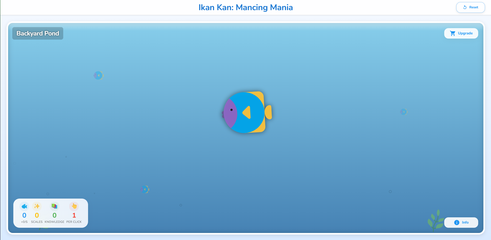

# Ikan Kan: Mancing Mania

An incremental idle fishing game where you build your fishing empire from a small pond to ocean mastery.



## Problem Solved

Provides an engaging, relaxing experience combining idle gameplay with strategic depth and educational elements about marine ecosystems.

## Key Features

- **Deep Progression System**: Advance from a small pond to ruling the oceans
- **Rich Economy System**: Multiple currencies and upgrade paths
- **Fish Collection**: Discover and collect hundreds of unique fish species
- **Ecosystem Management**: Balance fishing with sustainability
- **Educational Elements**: Learn about marine life through gameplay

## Quick Start

### Prerequisites

- Node.js (v14.0 or higher recommended, project uses v20.x compatibility via react-scripts)
- NPM (v6.0 or higher)

### Setup

```bash
# Clone the repository
git clone https://github.com/aikazu/ikan-kan.git

# Navigate to project directory
cd ikan-kan

# Install dependencies
npm install

# Start development server
npm start
```

## Basic Usage

Once the development server is running, open your browser to the specified local address (usually `http://localhost:3000`).
Interact with the game elements on the screen to:
- Catch fish
- Purchase upgrades
- Explore different game areas as you progress

## Architecture Overview

For a detailed system design and component overview, please see [@Architecture](ARCHITECTURE.md).

## Technology Stack

- **Frontend**: HTML5, CSS3, JavaScript, React
- **State Management**: Redux
- **Build Tools**: Webpack, Babel
- **Testing**: Jest, React Testing Library
- **Storage**: LocalStorage, optional Firebase for cloud saves

## Project Structure

```bash
ikan-kan/
├── public/             # Static assets, PWA manifest
├── src/                # Source code
│   ├── components/     # React UI components
│   ├── store/          # Redux state management (actions, reducers, store)
│   ├── game/           # Core game logic, progression, mechanics
│   ├── data/           # Static game data (fish types, upgrades)
│   ├── utils/          # Utility functions
│   ├── App.js          # Main application component
│   └── index.js        # Application entry point
├── .gitignore          # Specifies intentionally untracked files
├── package.json        # Project metadata and dependencies
└── README.md           # This file
```
(Note: `docs/` and `tests/` directories from the original README are not yet present or have been integrated elsewhere by `create-react-app`)

## Documentation Map

- [@IDEA](IDEA.md) - Project concept, game progression, and features.
- [@TASK](TASK.md) - Current tasks, backlog, and progress.
- [@STATE](STATE.md) - System state snapshots and checkpoints.
- [@ARCHITECTURE](ARCHITECTURE.md) - System design, components, and technical architecture.
- [@DECISIONS](DECISIONS.md) - Log of key technical and design decisions.
- [@Tech Stack (inferred)](ikan-kan/package.json) - Dependencies defining the tech stack.

## Contribution Guidelines

(To be defined. Standard contribution practices like feature branches, pull requests, and code reviews will likely be adopted.)

## License

MIT License
